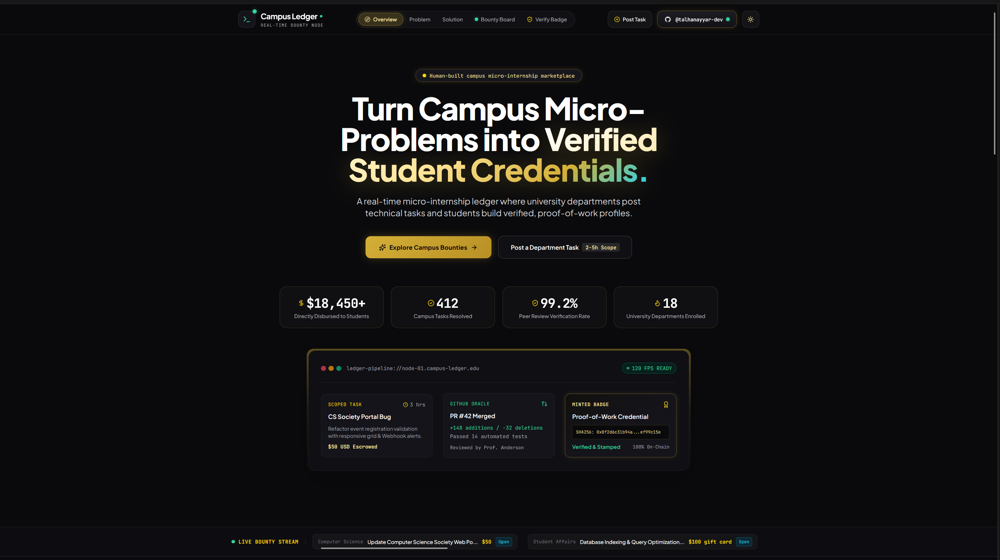

# Campus Ledger

Campus Ledger is a university micro-internship and campus bounty board that helps departments turn small technical backlogs into paid student opportunities. Students can claim scoped tasks, submit GitHub pull requests, and build a verified profile of real work that is easier to trust than a resume alone.



## Problem

University departments, student societies, labs, and administrative teams often have small technical tasks that are important but too small for a formal vendor contract. Examples include fixing event forms, optimizing a database query, setting up webhook alerts, improving a dashboard, or automating a manual spreadsheet workflow.

At the same time, students need real experience, but many only have classroom projects or tutorial clones to show. This creates a gap: departments need fast help, and students need credible proof that they can ship useful work.

## Solution

Campus Ledger creates a simple workflow:

1. Departments post 2-to-5 hour tasks with clear deliverables.
2. Students claim tasks and submit pull requests through GitHub.
3. Approved work creates a verified credential in the student's profile.
4. Students receive cash or gift-card rewards instead of a points system.

The app includes a landing page, live bounty ticker, department showcase, student dashboard, bounty filters, post-task modal, GitHub profile modal, claim workflow, and badge verifier.

## Impact on University Students

Campus Ledger can help students earn while learning, practice on real campus problems, and build a stronger portfolio with proof attached to completed work. A student who fixes a registrar script, repairs a club website, or improves a lab dashboard can show practical impact, reviewer approval, and a linked pull request.

For university life, this means fewer stalled department tasks, faster support for student societies, and more chances for students to work on problems that affect their own campus.

## Theme Integration

The project uses a `+twe` theme approach through Tailwind CSS extension. I used the theme to make the interface feel like a polished human-built campus product instead of a generic template. The visual system extends Tailwind with custom gold, emerald, cyan, and surface tokens, then applies those tokens through reusable utility classes such as `glass-card`, `gold-glow-btn`, and `gold-gradient-text`.

I also added a human-friendly light/dark mode toggle next to the GitHub button. The dark theme keeps the original premium ledger look, while the light theme overrides the dark surface utilities for a cleaner daytime presentation without rebuilding every component.

## Tech Stack

- React
- TypeScript
- Vite
- Tailwind CSS
- Lucide React icons
- Canvas Confetti

## Website Link

```bash
https://muhd-talhacodey.github.io/Campus-Ledger/
```
